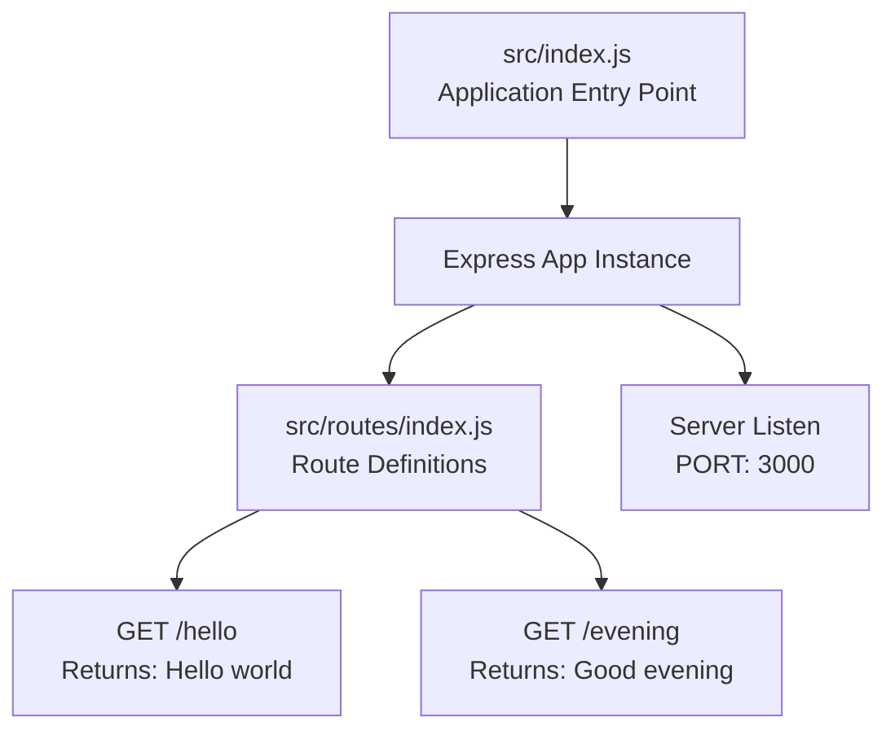

# Technical Specification

# 0. Agent Action Plan

## 0.1 Intent Clarification

### 0.1.1 Core Feature Objective

Based on the prompt, the Blitzy platform understands that the new feature requirement is to:

- **Add Express.js Framework**: Integrate the Express.js web framework into the existing Node.js project to enable structured HTTP endpoint handling
- **Create "Good evening" Endpoint**: Implement a new HTTP endpoint that returns the string response "Good evening"
- **Maintain Existing "Hello world" Endpoint**: Ensure the existing endpoint that returns "Hello world" continues to function correctly (migration from native Node.js HTTP to Express.js routing)
- **Establish RESTful API Structure**: Transform the basic Node.js HTTP server into a properly structured Express.js application

**Implicit Requirements Detected:**
- Initialize a proper Node.js project structure with `package.json` (currently only README.md exists)
- Configure npm dependencies for Express.js framework
- Establish proper route organization for multiple endpoints
- Set up appropriate HTTP server listening on a configurable port
- Implement proper response handling with correct content types

**Feature Dependencies and Prerequisites:**
- Node.js runtime (version 18.x or higher required for Express.js 5.x)
- npm package manager for dependency management
- Basic HTTP GET request/response handling patterns

### 0.1.2 Special Instructions and Constraints

**Architectural Requirements:**
- Use Express.js as the primary web framework (not native Node.js `http` module directly)
- Follow Express.js conventions for route registration and middleware patterns
- Maintain clean separation of concerns between route definitions and server initialization

**Backward Compatibility:**
- The existing "Hello world" endpoint must continue to return "Hello world" after migration to Express.js

**User Example:**
- Original endpoint: Returns "Hello world"
- New endpoint: Returns "Good evening"

**Web Search Research Requirements:**
- Express.js latest stable version and Node.js compatibility
- Best practices for Express.js route organization
- Express.js response handling patterns

### 0.1.3 Technical Interpretation

These feature requirements translate to the following technical implementation strategy:

- **To implement Express.js integration**, we will install `express` as a project dependency and configure it as the application entry point
- **To create the "Hello world" endpoint**, we will define an Express.js route handler that responds with plain text "Hello world"
- **To create the "Good evening" endpoint**, we will define a separate Express.js route handler that responds with plain text "Good evening"
- **To structure the project properly**, we will create a `package.json` manifest, main application file, and organized route definitions
- **To enable server functionality**, we will configure Express.js to listen on a designated port (typically 3000 or via environment variable)

## 0.2 Repository Scope Discovery

### 0.2.1 Comprehensive File Analysis

**Current Repository State:**

The repository is in a minimal state, containing only a single file:

| File Path | Type | Current Content | Status |
|-----------|------|-----------------|--------|
| `README.md` | Documentation | Contains only heading "# 12nov06" | MODIFY |

**Files Requiring Modification:**
- `README.md` - Update to document the Express.js application, endpoints, and usage instructions

**Integration Point Discovery:**

Since this is essentially a greenfield project for Node.js/Express, the integration points are:

- **API Endpoints**: Two GET endpoints to be created:
  - `/` or `/hello` - Returns "Hello world"
  - `/evening` or `/good-evening` - Returns "Good evening"
- **Server Configuration**: Express.js application initialization and port binding
- **Package Management**: npm dependencies and scripts

### 0.2.2 Web Search Research Conducted

Research completed for implementing this feature:

| Topic | Finding | Source |
|-------|---------|--------|
| Express.js Version | 5.2.1 (latest stable) | npm registry |
| Node.js Compatibility | Requires Node.js 18.x or higher | Express.js GitHub releases |
| Express.js Release | v5.0 released October 15, 2024 | Express.js changelog |
| Basic Pattern | Minimalist web framework for Node.js | Official documentation |

**Best Practices Identified:**
- Use `express()` factory function to create app instance
- Define routes using `app.get()`, `app.post()`, etc.
- Use `res.send()` for plain text responses
- Configure port via environment variable with fallback default

### 0.2.3 New File Requirements

**New Source Files to Create:**

| File Path | Purpose | Priority |
|-----------|---------|----------|
| `package.json` | npm package manifest with dependencies and scripts | Critical |
| `src/index.js` | Main application entry point with Express.js server setup | Critical |
| `src/routes/index.js` | Route definitions for all endpoints | Critical |
| `.gitignore` | Git ignore patterns for node_modules and environment files | High |
| `.env.example` | Example environment variables file | Medium |

**New Test Files:**

| File Path | Purpose | Priority |
|-----------|---------|----------|
| `tests/routes.test.js` | Unit tests for endpoint responses | High |
| `package.json` (test scripts) | Test runner configuration | High |

**New Configuration:**

| File Path | Purpose | Priority |
|-----------|---------|----------|
| `package.json` | Dependencies (express), scripts (start, test, dev) | Critical |
| `.env.example` | PORT environment variable documentation | Medium |

## 0.3 Dependency Inventory

### 0.3.1 Private and Public Packages

**Production Dependencies:**

| Registry | Package Name | Version | Purpose |
|----------|--------------|---------|---------|
| npm | express | ^5.2.1 | Web framework for HTTP server and routing |

**Development Dependencies:**

| Registry | Package Name | Version | Purpose |
|----------|--------------|---------|---------|
| npm | jest | ^29.7.0 | Testing framework for unit tests |
| npm | supertest | ^7.0.0 | HTTP assertions for endpoint testing |
| npm | nodemon | ^3.1.0 | Development server with auto-reload |

**Runtime Requirements:**

| Component | Version | Reason |
|-----------|---------|--------|
| Node.js | ≥18.x | Required by Express.js 5.x (dropped support for older versions) |
| npm | ≥9.x | Package management and script execution |

### 0.3.2 Dependency Updates

**Import Configuration:**

Since this is a new project, no existing imports need to be updated. However, the following import patterns will be established:

```javascript
// ES Module style (recommended for new projects)
import express from 'express';
```

Or CommonJS style:

```javascript
// CommonJS style
const express = require('express');
```

**Package.json Configuration:**

The `package.json` will be configured with:

- `"type": "module"` for ES Module support (optional)
- `"main": "src/index.js"` as entry point
- Scripts for development, production, and testing

### 0.3.3 External Reference Updates

**Configuration Files to Create:**

| File | Configuration Purpose |
|------|----------------------|
| `package.json` | npm package manifest with express dependency |
| `.gitignore` | Exclude `node_modules/`, `.env`, coverage reports |
| `.env.example` | Document PORT and other environment variables |

**Build and Runtime Files:**

| File | Purpose |
|------|---------|
| `package.json` (scripts.start) | Production server start: `node src/index.js` |
| `package.json` (scripts.dev) | Development server: `nodemon src/index.js` |
| `package.json` (scripts.test) | Test execution: `jest` |

## 0.4 Integration Analysis

### 0.4.1 Existing Code Touchpoints

**Direct Modifications Required:**

| File | Modification | Location |
|------|--------------|----------|
| `README.md` | Complete rewrite with project documentation | Entire file |

**New Code Integrations:**

Since this is a greenfield implementation, the following integration architecture will be established:



### 0.4.2 API Endpoint Integration

**Endpoint Registration Pattern:**

| Endpoint | HTTP Method | Handler Location | Response |
|----------|-------------|------------------|----------|
| `/hello` | GET | `src/routes/index.js` | "Hello world" |
| `/evening` | GET | `src/routes/index.js` | "Good evening" |

**Request/Response Flow:**

1. Client sends HTTP GET request to endpoint
2. Express.js router matches route pattern
3. Route handler executes response logic
4. `res.send()` returns plain text response
5. Express.js sends HTTP 200 response with Content-Type: text/html

### 0.4.3 Application Structure Integration

**Module Integration Points:**

| Module | Integrates With | Integration Type |
|--------|-----------------|------------------|
| `src/index.js` | `src/routes/index.js` | Route import and registration |
| `src/index.js` | `express` | Framework initialization |
| `tests/routes.test.js` | `src/index.js` | Test target import |
| `tests/routes.test.js` | `supertest` | HTTP assertion library |

**Configuration Integration:**

| Configuration | Location | Used By |
|---------------|----------|---------|
| PORT | Environment variable / `.env` | `src/index.js` for server binding |
| Test scripts | `package.json` | npm test command |
| Start scripts | `package.json` | npm start command |

## 0.5 Technical Implementation

### 0.5.1 File-by-File Execution Plan

**CRITICAL: Every file listed below MUST be created or modified.**

**Group 1 - Core Application Files:**

| Action | File Path | Purpose |
|--------|-----------|---------|
| CREATE | `package.json` | npm package manifest with Express.js dependency, scripts, and metadata |
| CREATE | `src/index.js` | Main application entry point - Express.js server initialization and startup |
| CREATE | `src/routes/index.js` | Route definitions for `/hello` and `/evening` endpoints |

**Group 2 - Supporting Infrastructure:**

| Action | File Path | Purpose |
|--------|-----------|---------|
| CREATE | `.gitignore` | Git ignore patterns for node_modules, .env, coverage |
| CREATE | `.env.example` | Template for environment variables (PORT) |
| MODIFY | `README.md` | Project documentation, setup instructions, API reference |

**Group 3 - Tests and Quality:**

| Action | File Path | Purpose |
|--------|-----------|---------|
| CREATE | `tests/routes.test.js` | Unit tests for both endpoints using Jest and Supertest |

### 0.5.2 Implementation Approach per File

**`package.json` - Package Manifest:**

```json
{
  "name": "12nov06",
  "scripts": { "start": "node src/index.js" }
}
```

Key configurations: name, version, description, main entry point, scripts (start, dev, test), dependencies (express), devDependencies (jest, supertest, nodemon)

**`src/index.js` - Application Entry Point:**

```javascript
const express = require('express');
const app = express();
```

Responsibilities: Import Express, create app instance, register routes, configure port, start server with listen()

**`src/routes/index.js` - Route Definitions:**

```javascript
router.get('/hello', (req, res) => {
  res.send('Hello world');
});
```

Responsibilities: Define Express Router, register GET /hello endpoint, register GET /evening endpoint, export router for use in main app

**`tests/routes.test.js` - Endpoint Tests:**

```javascript
const request = require('supertest');
const app = require('../src/index');
```

Responsibilities: Test /hello returns "Hello world", test /evening returns "Good evening", verify HTTP 200 status codes

### 0.5.3 Implementation Sequence


**Execution Order:**
1. Initialize package.json with project metadata
2. Install dependencies (express, jest, supertest, nodemon)
3. Create main application file with Express setup
4. Create routes file with endpoint handlers
5. Create test file with endpoint assertions
6. Create .gitignore for proper version control
7. Update README.md with documentation
8. Execute tests to verify implementation

## 0.6 Scope Boundaries

### 0.6.1 Exhaustively In Scope

**Source Files (using wildcards where patterns apply):**

| Pattern | Description |
|---------|-------------|
| `src/**/*.js` | All JavaScript source files in src directory |
| `src/index.js` | Main application entry point |
| `src/routes/*.js` | All route definition files |

**Test Files:**

| Pattern | Description |
|---------|-------------|
| `tests/**/*.js` | All test files |
| `tests/**/*.test.js` | All Jest test specification files |

**Configuration Files:**

| File | Purpose |
|------|---------|
| `package.json` | npm package manifest and dependency declarations |
| `package-lock.json` | Locked dependency versions (auto-generated) |
| `.gitignore` | Version control ignore patterns |
| `.env.example` | Environment variable template |

**Documentation:**

| File | Purpose |
|------|---------|
| `README.md` | Project documentation, setup guide, API reference |

**Integration Points:**

| Integration | Files Affected |
|-------------|----------------|
| Route registration | `src/index.js` (app.use for routes) |
| Endpoint definitions | `src/routes/index.js` (/hello and /evening) |

### 0.6.2 Explicitly Out of Scope

The following items are explicitly **NOT** part of this feature implementation:

| Item | Reason |
|------|--------|
| Database integration | Not specified in requirements |
| Authentication/Authorization | Not required for simple endpoints |
| Frontend UI | Backend-only API endpoints |
| Middleware (logging, CORS, etc.) | Beyond basic requirements |
| Docker/containerization | Not specified in requirements |
| CI/CD pipeline configuration | Not specified in requirements |
| Load balancing or clustering | Not specified in requirements |
| HTTPS/TLS configuration | Not specified in requirements |
| Request body parsing | GET endpoints return static strings |
| Error handling middleware | Basic Express defaults sufficient |
| API versioning | Single version implementation |
| Rate limiting | Not specified in requirements |
| API documentation (Swagger/OpenAPI) | Not specified in requirements |

### 0.6.3 Validation Criteria

**Implementation Acceptance Criteria:**

| Criterion | Validation Method |
|-----------|-------------------|
| `/hello` endpoint returns "Hello world" | HTTP GET request returns exact string |
| `/evening` endpoint returns "Good evening" | HTTP GET request returns exact string |
| Express.js is properly integrated | package.json includes express dependency |
| Server starts without errors | npm start executes successfully |
| All tests pass | npm test returns 0 exit code |
| Documentation is complete | README.md contains setup and usage instructions |

**Response Format Validation:**

| Endpoint | Expected Response | Content-Type |
|----------|-------------------|--------------|
| GET /hello | "Hello world" | text/html |
| GET /evening | "Good evening" | text/html |

## 0.7 Special Instructions

### 0.7.1 Feature-Specific Requirements

**User-Emphasized Requirements:**

| Requirement | Implementation Approach |
|-------------|------------------------|
| Add Express.js to the project | Install express@^5.2.1 via npm |
| Endpoint returning "Hello world" | Create GET /hello route handler |
| Endpoint returning "Good evening" | Create GET /evening route handler |

**Exact User Request Preserved:**
> "this is a tutorial of node js server hosting one endpoint that returns the response 'Hello world'. Could you add expressjs into the project and add another endpoint that return the reponse of 'Good evening'?"

### 0.7.2 Conventions to Follow

**Code Organization Patterns:**

- Separate route definitions from main application file
- Use Express Router for modular route organization
- Follow CommonJS module pattern (or ES Modules if preferred)
- Use environment variables for configuration (PORT)

**Naming Conventions:**

| Type | Convention | Example |
|------|------------|---------|
| Files | kebab-case or camelCase | `index.js`, `routes.js` |
| Routes | lowercase with hyphens | `/hello`, `/evening` |
| Variables | camelCase | `const app`, `const router` |
| Constants | UPPER_SNAKE_CASE | `PORT`, `DEFAULT_PORT` |

### 0.7.3 Node.js and Express.js Requirements

**Runtime Requirements:**

| Component | Version | Notes |
|-----------|---------|-------|
| Node.js | ≥18.x | Required for Express.js 5.x compatibility |
| npm | ≥9.x | For package management |
| Express.js | ^5.2.1 | Latest stable version |

**Express.js 5.x Specific Considerations:**

- Dropped support for Node.js versions before v18
- Promise support: Middleware can now return rejected promises
- Updated routing with path-to-regexp@8.x
- Removed deprecated API methods from Express v3/v4

### 0.7.4 Testing Requirements

**Test Coverage Requirements:**

| Endpoint | Test Cases |
|----------|------------|
| GET /hello | Returns "Hello world", HTTP 200 status |
| GET /evening | Returns "Good evening", HTTP 200 status |

**Test Framework Configuration:**

- Use Jest as test runner
- Use Supertest for HTTP assertions
- Configure test scripts in package.json

### 0.7.5 Documentation Requirements

**README.md Must Include:**

- Project title and description
- Prerequisites (Node.js version)
- Installation instructions (`npm install`)
- Running the application (`npm start`, `npm run dev`)
- API endpoint documentation
- Running tests (`npm test`)
- Environment variable configuration

